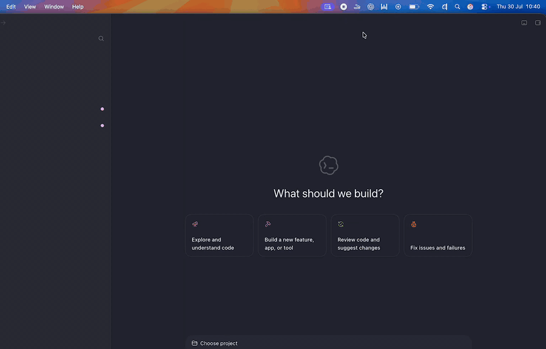

# Clamshell Guard

Keep long-running Codex tasks alive even when you close your MacBook lid.
Clamshell Guard automatically prevents sleep while Codex is working, then
restores normal sleep when the task finishes.



> [!IMPORTANT]
> **This is a fork of
> [`machinefriendly/awaketoggle`](https://github.com/machinefriendly/awaketoggle).**
> MachineFriendly created the original AwakeToggle app and its core
> `pmset disablesleep` technique. Clamshell Guard is an independently maintained
> extension and is not an official MachineFriendly release.

Clamshell Guard provides three modes:

- **ON** — always prevent sleep
- **AUTO** — prevent sleep while the macOS Codex app is running one or more
  tasks, including side tasks
- **OFF** — use normal macOS sleep behaviour

## What this fork adds

The [original AwakeToggle](https://github.com/machinefriendly/awaketoggle) is a
deliberately minimal manual on/off switch. This fork retains that core behaviour
and adds:

| Area | Original project | This fork |
| --- | --- | --- |
| Controls | Single manual on/off toggle | **ON / AUTO / OFF** mode selector |
| Codex integration | None | **AUTO** follows live Codex Desktop task state, including concurrent and side tasks |
| Monitor resilience | Not applicable | Reconnects after Codex restarts or socket-owner changes and reports unavailable state safely |
| Sleep protection | `pmset disablesleep` | `pmset disablesleep` plus a process-scoped IOKit `PreventSystemSleep` assertion |
| Lid-close display handling | No explicit display command | Runs `pmset displaysleepnow` once per lid-close transition |
| Launch at login | Not included | Optional native login item using `SMAppService` |
| Authorization | macOS administrator prompt when toggled | Non-interactive `sudo -n` with a sudoers rule restricted to the exact on/off commands |
| Verification | Minimal upstream source | Unit/integration tests and documented [Codex IPC research](docs/CODEX_IPC_RESEARCH.md) |

AUTO mode waits 5 seconds after the final Codex task finishes before restoring
normal sleep. If Codex status cannot be read reliably, it reports that status as
unavailable instead of treating the failure as zero active tasks.

macOS 12+ · Intel and Apple silicon

📖 Background: [Keep Your MacBook Awake With the Lid Closed](https://www.machinefriendly.com/blog/keep-macbook-awake-lid-closed-awaketoggle) — why `caffeinate` doesn't work for this.

---

## Installation

AUTO mode needs the app in `/Applications` and a narrowly scoped sudoers rule
for changing the sleep setting without repeated password prompts. Clamshell Guard
reads live task status directly from the local Codex Desktop app; no Codex hook
configuration is required.

### 1. Build and install the app

Install the Xcode Command Line Tools if needed, then run:

```bash
xcode-select --install
./build.sh
ditto "Clamshell Guard.app" "/Applications/Clamshell Guard.app"
open "/Applications/Clamshell Guard.app"
```

`./build.sh` creates a universal Intel/Apple-silicon app and
`ClamshellGuard.zip`. You can drag the app into **Applications** instead of using
`ditto`.

If macOS blocks the first launch because this locally built app is not
notarized, follow the [Opening an unnotarized build](#opening-an-unnotarized-build)
steps below.

### 2. Allow only Clamshell Guard's two `pmset` changes without a password

Clamshell Guard runs these two commands:

```bash
/usr/bin/sudo -n /usr/bin/pmset -a disablesleep 1
/usr/bin/sudo -n /usr/bin/pmset -a disablesleep 0
```

The `-n` flag means “never show a password prompt.” The command succeeds only
when sudoers already permits it; otherwise Clamshell Guard leaves the setting
unchanged.

First find your short macOS username:

```bash
id -un
```

Open a dedicated sudoers file with the syntax-checking editor:

```bash
sudo visudo -f /etc/sudoers.d/clamshell-guard-pmset
```

Add this as one line, replacing `yourusername` with the output from `id -un`:

```text
yourusername ALL=(root) NOPASSWD: /usr/bin/pmset -a disablesleep 0, /usr/bin/pmset -a disablesleep 1
```

Save and exit, then validate the file:

```bash
sudo visudo -cf /etc/sudoers.d/clamshell-guard-pmset
```

It should report `parsed OK`. Confirm that the OFF operation works without a
cached password:

```bash
sudo -k
sudo -n /usr/bin/pmset -a disablesleep 0
```

If the second command asks for a password or prints `a password is required`,
do not broaden the rule: reopen the file with `visudo` and check the username,
absolute path, and arguments.

> Upgrading from AwakeToggle? An existing
> `/etc/sudoers.d/awaketoggle-pmset` file remains valid because sudo matches the
> permitted command and arguments, not the app name. Renaming that file is
> optional.
>
> Earlier local installations used
> `yourusername ALL=(root) NOPASSWD: /usr/bin/pmset`. That works, and still does
> not disable authentication for other programs, but it permits every `pmset`
> option. The two-command rule above is safer because it matches only the exact
> ON and OFF operations used by Clamshell Guard.

### 3. Test AUTO

1. Start Clamshell Guard and select **AUTO**.
2. Start a new task in the macOS Codex app.
3. Clamshell Guard should show `AUTO · 1 active Codex task`.
4. When the task finishes, Clamshell Guard waits 5 seconds and returns to
   `AUTO · No active Codex tasks`.

You can inspect the underlying state at any time:

```bash
/usr/bin/pmset -g | /usr/bin/grep SleepDisabled
```

`SleepDisabled 1` means keep-awake is active; `0` means macOS may sleep
normally. Tasks already running when Clamshell Guard starts are detected from
Codex's current state.

### 4. Optional: launch at login

Open the Clamshell Guard menu and enable **Launch on Login**. This uses
`SMAppService`, macOS's native login-item API. If macOS reports that approval is
required, approve Clamshell Guard under **System Settings → General → Login
Items**.

---

## Usage

- **Click the icon** — open the mode menu
- **Closed-laptop icon** = stay-awake is on
- **Open-laptop icon** = normal sleep
- **Launch on Login** — start Clamshell Guard automatically after signing in

The UI follows your system language: **English, 中文, or Français** (anything else falls back to English).

This installation uses a narrowly scoped sudoers rule so only the two exact
`/usr/bin/pmset -a disablesleep` changes can run without another password
prompt. Clamshell Guard uses absolute paths and never receives or stores your
password.

It doesn't phone home or collect data. Launch at login is optional and uses
macOS's native login-item service.

### AUTO mode

AUTO connects to Codex Desktop's per-user Unix socket:

```text
~/.codex/ipc/ipc.sock
```

It discovers recently updated task IDs from Codex's local state database and
subscribes to their live runtime state. It enables keep-awake while at least one
parent task reports `active` or a Codex side task reports `pendingInit` or
`running`. Parent and side-task IDs are deduplicated, and AUTO waits 5 seconds
after the last task ends before allowing sleep. This avoids maintaining a
separate task counter, so cancellation and missed lifecycle events cannot leave
stale marker files.

This IPC interface is private to Codex Desktop and may change in a future Codex
release. If Clamshell Guard cannot validate the socket, open the state database, or
understand the IPC response, it shows `AUTO · Codex status unavailable` rather
than claiming there are no active tasks. It reconnects automatically.

Codex snapshots can contain more than runtime status. Clamshell Guard extracts
only `threadRuntimeStatus` plus side-task IDs and lifecycle status from
`collabAgentToolCall` items. It does not log or retain snapshot contents and
makes no network requests. The complete protocol investigation, validation
evidence, and compatibility notes are recorded in
[`docs/CODEX_IPC_RESEARCH.md`](docs/CODEX_IPC_RESEARCH.md).

---

## Why you'll see "Apple could not verify this app is free of malware"

**This is not a malware detection.** macOS shows this for *any* app that hasn't been through Apple's **notarization**, regardless of whether it's safe. Notarization requires an Apple Developer account at **$99/year**.

This fork is not Developer ID signed or notarized. Treat it like any
unnotarized binary:
**don't take the maintainer's word for it—review the source and build it
yourself.**

### Don't trust me — read it

- The menu-bar app is in [`ClamshellGuard.swift`](ClamshellGuard.swift), and its
  Codex status monitor is in [`CodexIPCMonitor.swift`](CodexIPCMonitor.swift).
- The only privileged thing it does is `pmset -a disablesleep 0/1` — Apple's own power-management command.
- **No network access or data collection.**
- [Build it yourself](#build-it-yourself) in one command and get the same app.

A notarized app can still do whatever it likes — the certificate proves someone
paid Apple, not that the code is good. The readable source is the more useful
security evidence here.

### Opening an unnotarized build

1. Unzip and drag `Clamshell Guard.app` into **Applications**
2. Double-click → blocked → click **Done** (⚠️ **not** "Move to Trash")
3. Open **System Settings → Privacy & Security**, scroll down to "Clamshell Guard was blocked"
4. Click **Open Anyway** → confirm once more
5. Done. It won't ask again.

> On macOS 15+, the old right-click → Open trick no longer works — Apple removed it. The route above is the only one now, which is why many tutorials you'll find are out of date.

---

## Build it yourself

Only the Xcode command line tools, no full Xcode install:

```bash
xcode-select --install     # if you haven't already
git clone https://github.com/hpkruger/clamshell-guard.git
cd clamshell-guard
./build.sh
```

Produces a universal binary (Intel + Apple silicon) targeting macOS 12+, ad-hoc signed and packaged into the same zip I ship.

---

## What it actually does

The lid-close power-management operation is:

```bash
sudo -n /usr/bin/pmset -a disablesleep 1
```

Turning keep-awake off uses the same command with `0`.

`pmset` ships with macOS. `disablesleep 1` stops the system sleeping when the lid closes. The app is just a switch for it, so you don't open a terminal every time.

`caffeinate` can't do this: it creates a *power assertion*, which holds off **idle** sleep. A lid close is an explicit sleep request, and no assertion overrides it. That's why `pmset` needs `sudo` and `caffeinate` doesn't.

While ON, or while AUTO has an active Codex task, Clamshell Guard also holds a
process-scoped IOKit `PreventSystemSleep` assertion. This complements the global
lid-close setting by preventing ordinary system sleep. macOS releases the
assertion automatically if Clamshell Guard exits or crashes; Clamshell Guard also
releases it explicitly when keep-awake turns off.

When the lid changes from open to closed while keep-awake protection is active,
Clamshell Guard also runs:

```bash
/usr/bin/pmset displaysleepnow
```

This puts all connected displays to sleep without putting the Mac itself to
sleep. The command runs once per lid-close transition; polling while the lid
remains closed does not repeatedly blank displays.

> ### ⚠️ Heat and battery
> Sleep stays disabled until you turn it back off — **a reboot doesn't reset it.** A Mac still running inside a closed bag has nowhere to dump heat and will drain flat. Watch the icon and switch it off when you're done. This is the reason there's a visible menu-bar indicator instead of a fire-and-forget script.

---

## Uninstalling or reverting the configuration

1. Select **OFF** and disable **Launch on Login** in Clamshell Guard.
2. Confirm normal sleep is restored:

   ```bash
   sudo /usr/bin/pmset -a disablesleep 0
   ```

3. Remove the dedicated sudoers file:

   ```bash
   sudo rm /etc/sudoers.d/clamshell-guard-pmset
   ```

   Legacy AwakeToggle installations may instead use
   `/etc/sudoers.d/awaketoggle-pmset`. Remove only the file you actually
   installed.
4. Quit Clamshell Guard and move `/Applications/Clamshell Guard.app` to the Trash.

Restoring `disablesleep 0` before deleting the app matters because the macOS
power setting can outlive the process that changed it.

---

## Requests

If you want more — scheduled windows or auto-off below a battery threshold —
**[open an issue](https://github.com/hpkruger/clamshell-guard/issues/new)** in this
fork. For the original minimal app, use the
[upstream repository](https://github.com/machinefriendly/awaketoggle).

---

## 中文说明

**合上盖子，Mac 也不休眠。** 菜单栏提供 **开启 / 自动 / 关闭**
三种模式；自动模式会在 macOS Codex App 有任务运行时阻止休眠。界面跟随系统语言
（中文 / English / Français）。

> **分支说明：** 本仓库基于
> [`machinefriendly/awaketoggle`](https://github.com/machinefriendly/awaketoggle)。
> MachineFriendly 创建了原始版本；本分支增加了 Codex 自动模式、登录时启动、
> 额外的休眠保护，以及合盖时关闭显示器等功能，并非 MachineFriendly 的官方版本。

### 为什么会看到「Apple 无法验证此 App 不含恶意软件」

**这不是说 App 有病毒。** macOS 对任何没经过 Apple「公证」的软件都会弹这个,不管它安不安全。公证需要 Apple 开发者账号,**每年 99 美元**。

本分支没有 Apple 开发者签名或经过 Apple 公证。因此不要只相信维护者的说明，请检查源码并自行编译:

- **全部源码就在这里**：菜单栏 App 为
  [`ClamshellGuard.swift`](ClamshellGuard.swift)，Codex 状态监控程序为
  [`CodexIPCMonitor.swift`](CodexIPCMonitor.swift)
- 唯一需要权限的操作就是 `pmset -a disablesleep`(macOS 自带命令)
- **不联网 · 不收集数据**；登录时启动为可选设置
- 不放心可以自己 `./build.sh` 编译,结果一模一样

### 怎么打开

1. 解压,把 `Clamshell Guard.app` 拖进「应用程序」
2. 双击 → 被拦下 → 点 **「完成」**(⚠️ 不要点「移到废纸篓」)
3. **系统设置 → 隐私与安全性** → 往下滚 → 点 **「仍要打开」** → 再确认一次
4. 搞定,以后不会再问

macOS 15 以后,右键→打开的老办法已经被 Apple 取消了,只能走上面这条路。

> **⚠️ 注意散热和电量:** 开启后要手动关掉才恢复,重启也不会重置。合盖不休眠意味着机器在包里继续跑,热量散不出去,电量也会耗光。菜单栏图标就是为了让你随时看见它开着。

有需求欢迎在**[本分支提交 Issue](https://github.com/hpkruger/clamshell-guard/issues/new)**。
原始精简版本的问题请前往
[`machinefriendly/awaketoggle`](https://github.com/machinefriendly/awaketoggle)。

---

## License

MIT — do whatever you want. See [LICENSE](LICENSE).

Original AwakeToggle created by
[MachineFriendly](https://github.com/machinefriendly/awaketoggle). Fork-specific
changes are maintained in
[`hpkruger/clamshell-guard`](https://github.com/hpkruger/clamshell-guard).
